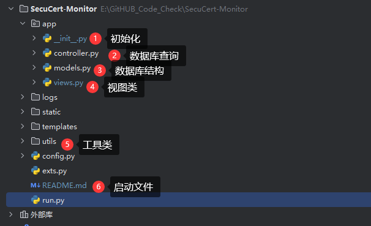
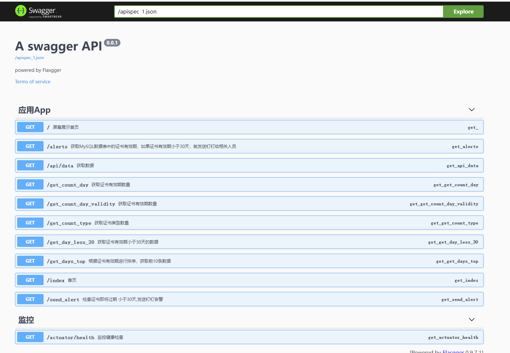
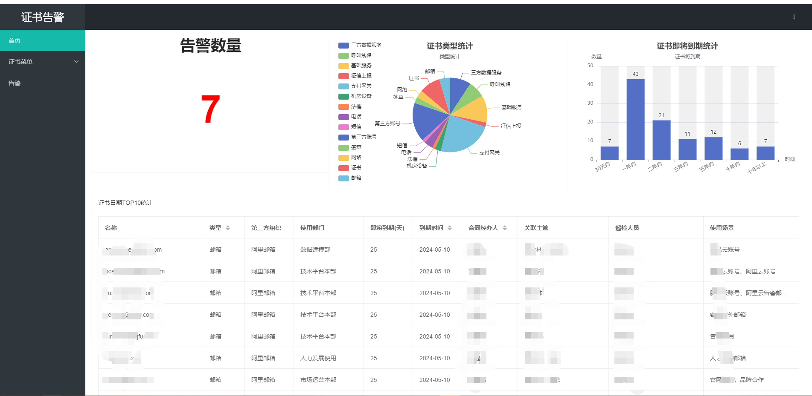
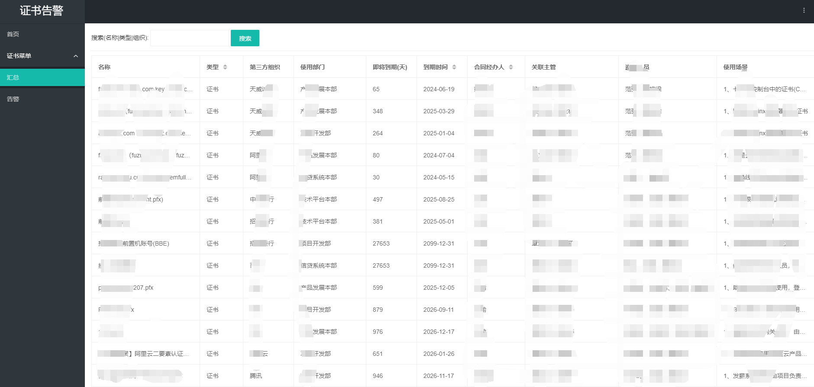
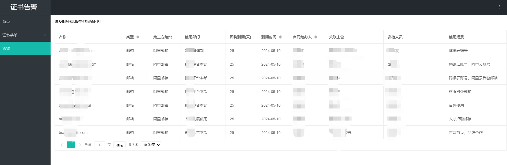
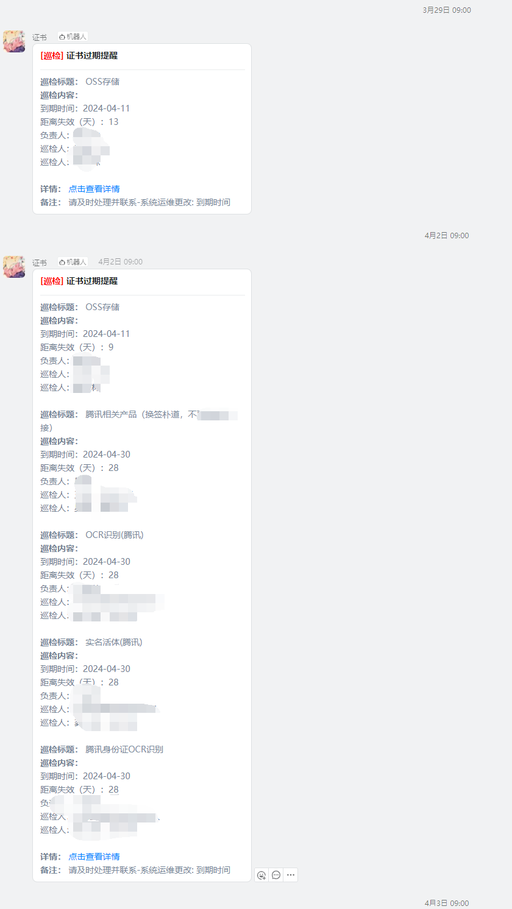

# SecuCert-Monitor
安全证书监控，定时巡检证书过期时间并且通知管理员

## 项目架构





## 数据

根据下方的数据格式进行导入

```
INSERT INTO `Certificate`.`expiration_monitor` (`id`, `service_name`, `use_deploy`, `deployA`, `deployB`, `product`, `scene`, `organ`, `manage`, `manage_id`, `issuance_date`, `expiration_date`, `header`, `tech`, `yumwei`, `yumwei_time`, `manager`, `type`, `remark`) VALUES (1, 'xxx.com（）', '产品发展本部', '产品发展本部', '技术平台本部', 'xxx', '1、七牛云控制台中的证书(CDN、SSL证书服务)\n2、阿里云控制台中的证书(WAF、SSL证书服务)\n', '天威诚信', '证书', '2023SZ-L-K-2456', '2023-05-19 00:00:00', '2024-06-19 00:00:00', 'xx', 'xx', 'xx、xx', '每月/次', 'xx、xx', '证书', 'nan');

```

## 效果演示

http://127.0.0.1:5000/apidocs/









